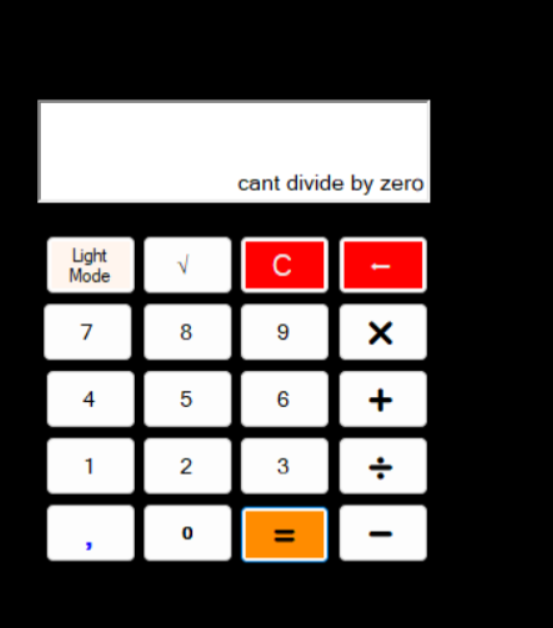
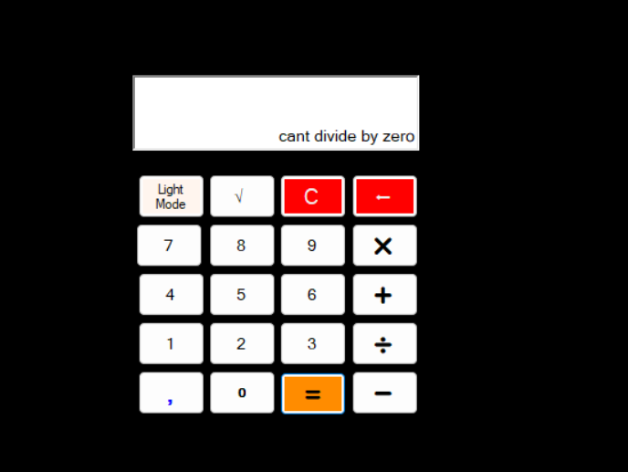
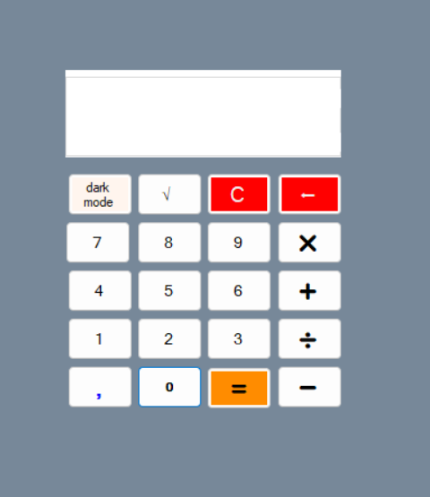

# 🧮 

# Calculator 2.0 - A Simple C# Calculator Application

## Overview
This is a basic calculator application developed in C# using Visual Studio. It supports standard arithmetic operations such as addition, subtraction, multiplication, and division, along with a square root function. 

## Features
- Basic arithmetic operations (+, -, ×, ÷)
- Square root calculation (√)
- Dark mode toggle
- Clear function (C)
- Decimal point support (.)


### How to Run This Project on Your Computer

If you downloaded this project from the internet (e.g., from GitHub), Windows might block some files. To ensure everything works correctly, follow these steps:

1. Download and extract the project folder to your computer.
2. Open the folder.
3. Right-click on an empty space inside the folder and select **"Open in Terminal"**.
4. In the terminal, run the following command:

   ```powershell
   Get-ChildItem -Recurse | Unblock-File

5. Finally, double-click the `.sln` file in the folder to open the project in Visual Studio.

## Screenshots







